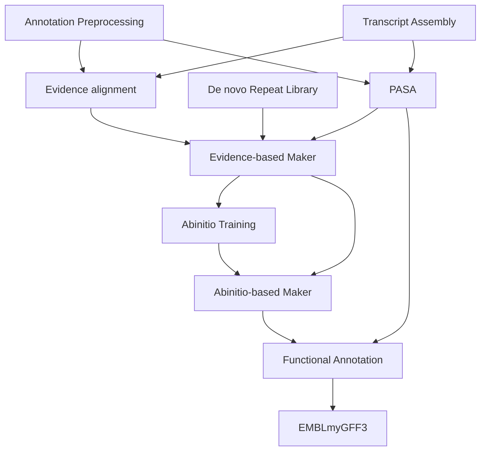

# NBIS Annotation service pipelines

## Table of Contents

* [Overview](#overview)
* [Citation](#citation)
* [Installation and Usage](#installation-and-usage)
* [Available pipelines](#available-pipelines)

## Overview

This Nextflow workflow is a compilation of several subworkflows for different stages of
genome annotation. Specifically:

* [Annotation preprocessing](./subworkflows/annotation_preprocessing/README.md)
* [Abinitio Training](./subworkflows/abinitio_training/README.md)
* [Functional annotation](./subworkflows/functional_annotation/README.md)
* [Transcript assembly](./subworkflows/transcript_assembly/README.md)

where the overall genome annotation process is:



The subworkflow is selected using the `subworkflow` parameter.

## Citation

If you use these pipelines in your work, please acknowledge NBIS within your
communication according to this example: "Support by NBIS (National Bioinformatics
Infrastructure Sweden) is gratefully acknowledged."

[](https://doi.org/10.5281/zenodo.5195586)

### Acknowledgments

These workflows were based on the Bpipe workflows written by
Marc Höppner (\@marchoeppner) and Jacques Dainat (\@Juke34).

Thank you to everyone who contributes to this project.

### Maintainers

* Mahesh Binzer-Panchal (\@mahesh-panchal)
  * *Expertise*: Nextflow workflow development
* Jacques Dainat (\@Juke34)
  * *Expertise*: Genome annotation, Nextflow workflow development
* Lucile Soler (\@LucileSol)
  * *Expertise*: Genome Annotation

## Installation and Usage

Requirements:

* Nextflow
* A container platform (recommended) such as Singularity or Docker, or the
  conda/mamba package manager if a container platform is not available.
  If containers or conda/mamba are unavailable, then tool dependencies
  must be accessible from your `PATH`.

### Nextflow

Install Nextflow directly:

```bash
curl -s https://get.nextflow.io | bash
mv ./nextflow ~/bin
```

Alternatively, installation can be managed with conda (or mamba) in it's own conda environment:

```bash
conda create -c conda-forge -c bioconda -n nextflow-env nextflow
conda activate nextflow-env
```

See [Nextflow: Get started - installation](https://www.nextflow.io/docs/latest/getstarted.html#installation) for further details.

### General Usage

A workflow is run in the following way:

```bash
nextflow run NBISweden/pipelines-nextflow \
  [-profile <profile_name1>[,<profile_name2>,...] ] \
  [-c workflow.config ] \
  [-resume] \
  -params-file workflow_parameters.yml
```

where `-profile` selects from a predefined profile (select here for [available profiles](#profiles)),
`-c workflow.config` loads a custom configuration for altering existing process settings (defined
in `nextflow.config` - loaded by default, such as the
number of cpus, time allocation, memory, output prefixes and tool command-line options ). The
`-params-file` is a YAML formatted file listing workflow parameters, e.g.

```yaml
subworkflow: 'annotation_preprocessing'
genome: '/path/to/genome'
busco_lineage:
  - 'eukaryota_odb10'
  - 'bacteria_odb10'
outdir: '/path/to/save/results'
```

> **Note**
> If running on a compute cluster infrastructure, `nextflow` must be able to communicate
> with the workload manager at all times, otherwise tasks will be cancelled.
> The best way to do this is to run `nextflow` using a `screen` or `tmux`
> terminal.
>
> E.g. Screen
>
> ```bash
> # Open a named screen terminal session
> screen -S my_nextflow_run
> # load nextflow with conda
> conda activate nextflow-env
> # run nextflow
> nextflow run -c <config> -profile <profile> <nextflow_script>
> # "Detach" screen terminal
> <ctrl + a> <ctrl + d>
> # list screen sessions
> screen -ls
> # "Attach" screen session
> screen -r my_nextflow_run
> ```

#### Profiles

* **uppmax**: A profile for the Uppmax clusters. Tasks are submitted to the SLURM workload manager,
  executed within Singularity (unless otherwise noted), and use the `$SNIC_TMP` scratch space.
  *Note*: The workflow parameter `project` is manadatory when using Uppmax clusters.
* **conda**: A general purpose profile that uses conda to manage software dependencies.
* **mamba**: A general purpose profile that uses mamba to manage software dependencies.
* **docker**: A general purpose profile that uses docker to manage software dependencies.
* **singularity**: A general purpose profile that uses singularity to manage software dependencies.
* **nbis**: A profile for the NBIS annotation cluster. Tasks are submitted to the SLURM workload
  manager, and use the disk space `/scratch` for task execution. Software should be managed using one
  of the general purpose profiles above.
* **gitpod**: A profile to set local executor settings in the Gitpod environment.
* **test**: A profile supplying test data to check if the workflows run on your system.
* **pipeline_report**: Adds a folder in the `outdir` which include workflow execution reports.

> **Note**
>
> Nextflow is enabled using the module system on Uppmax.
>
> ```bash
> module load bioinfo-tools Nextflow
> ```
>
> The following configuration in your `workflow.config` is recommended when running workflows on Uppmax.
>
> ```nextflow
> // Set your work directory to a folder in your project directory under nobackup
> workDir = '/proj/<snic_storage_project>/nobackup/work'
> // Restart workflows from last successful execution (i.e. use cached results where possible).
> resume = true
> // Add any overriding process directives here, e.g.,
> process {
>     withName: 'BLAST_BLASTN' {
>         cpus = 12
>         time = 2.d
>     }
> }
> ```

Note: The FunctionalAnnotation pipeline needs one tool installed in the `PATH` along with its databases.
See [FunctionalAnnotation](./FunctionalAnnotation) for details.

## Available pipelines

See their respective READMEs for operation instructions.

* [Abinitio training](./subworkflows/abinitio_training/README.md):
A pipeline for creating a training and testing data set for Augustus and Snap.

* [Annotation preprocessing](./subworkflows/annotation_preprocessing/README.md):
A pipeline for preprocessing genome assemblies in preparation for genome annotation.

* [Functional annotation](./subworkflows/functional_annotation/README.md):
A pipeline for functional annotation.

* [Transcript assembly](./subworkflows/transcript_assembly/README.md):
A transcript assembly pipeline using hisat2 and stringtie.
